DESCRIPTION
-----------

**AppSheet** is a no-code app development platform by Google that allows users to create mobile and web apps using data from sources like Google Sheets, Excel, and databases—without needing to write code.

USAGE
-----

Link: https://about.appsheet.com/home/

EXAMPLE HELLO WORLD
-------------------

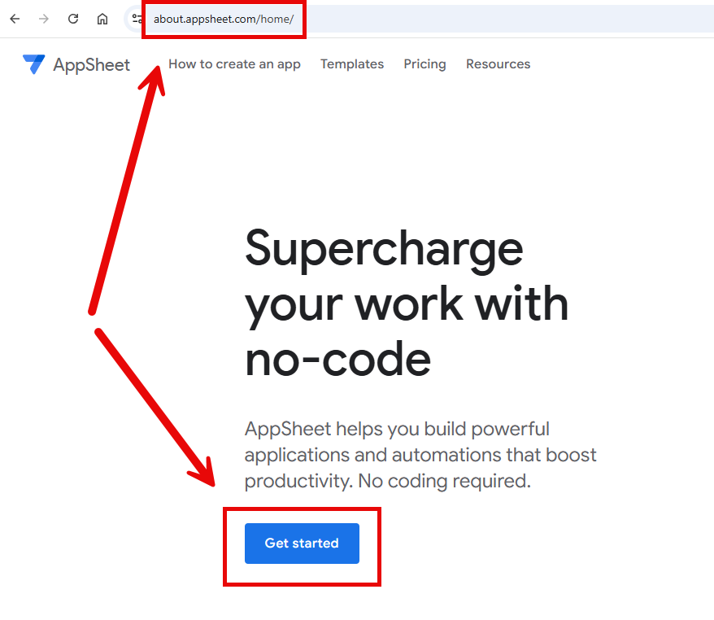

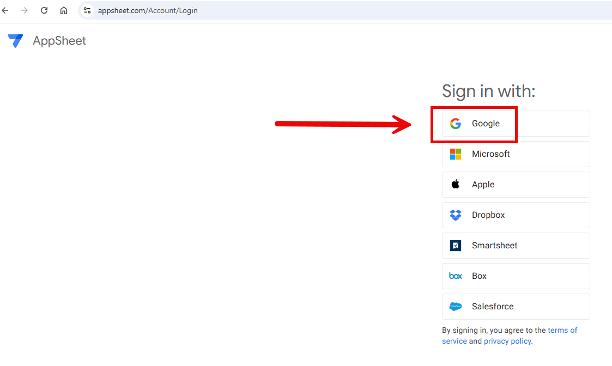

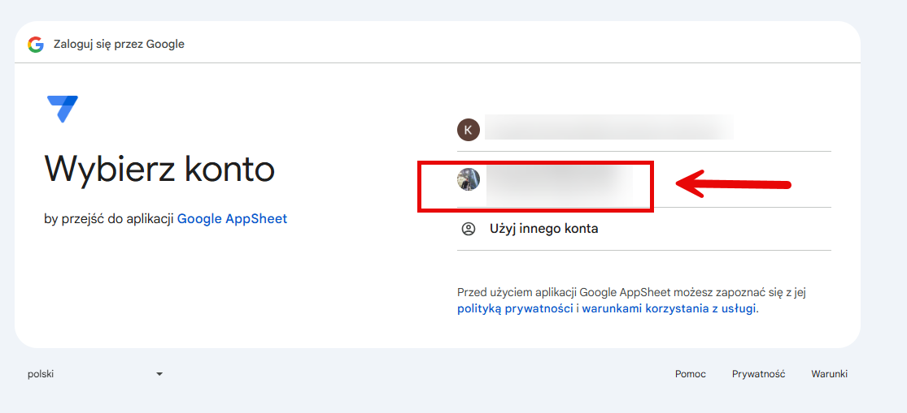

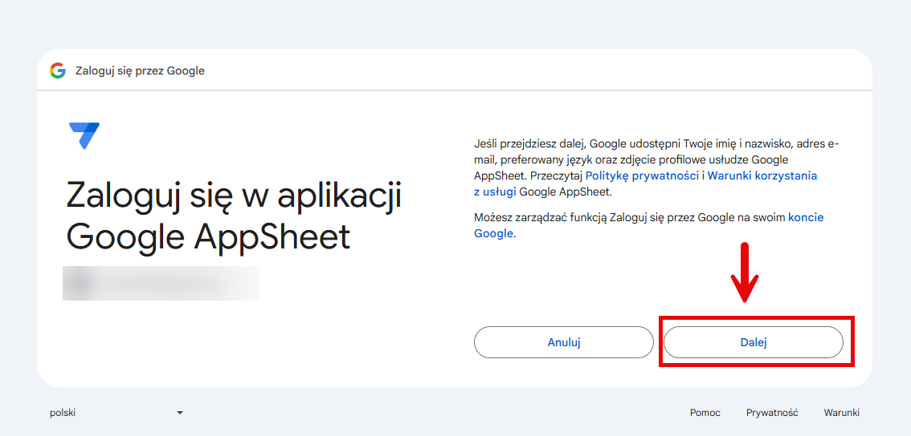

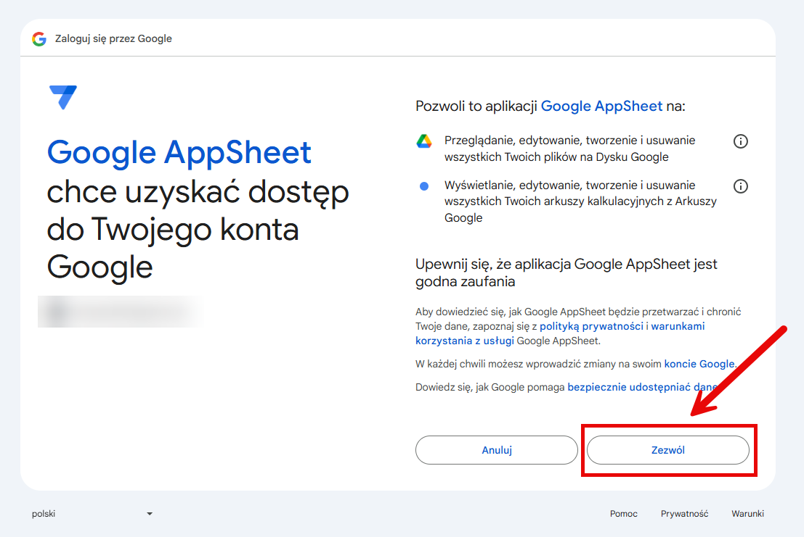

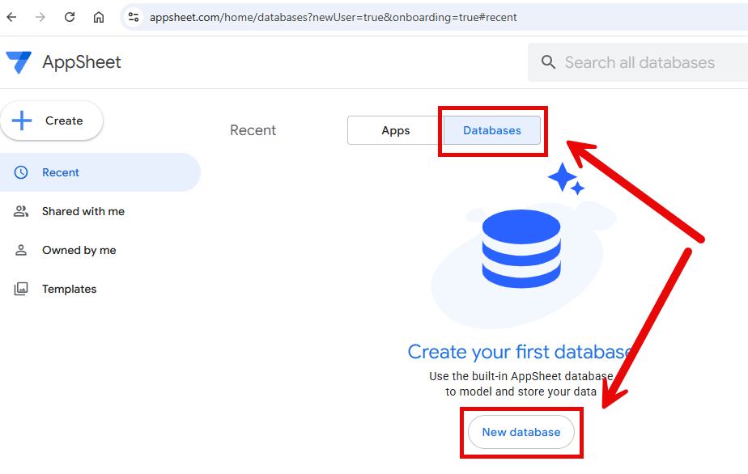

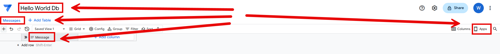

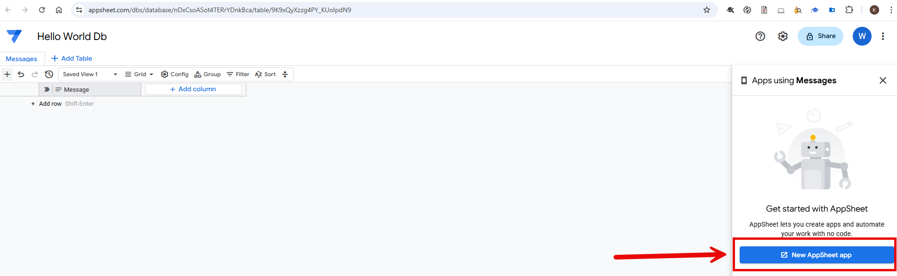

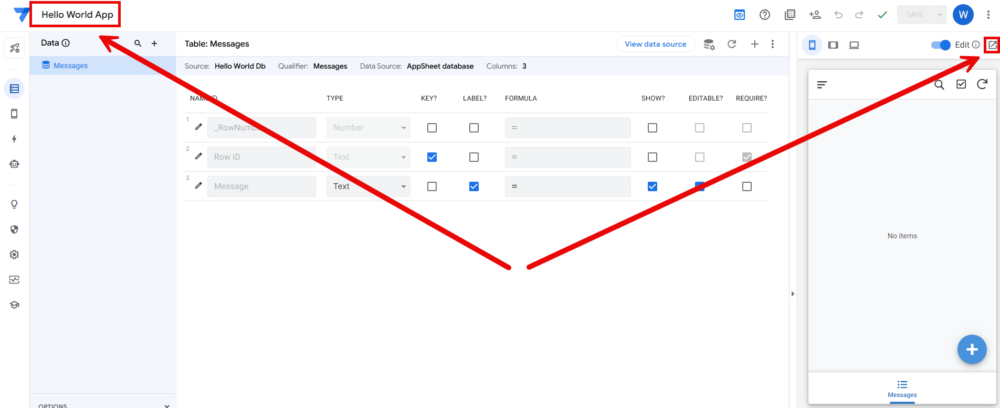

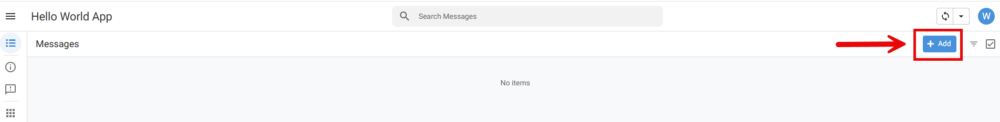

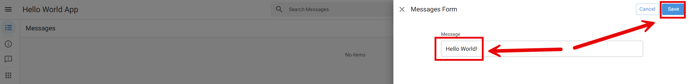

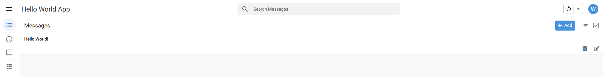

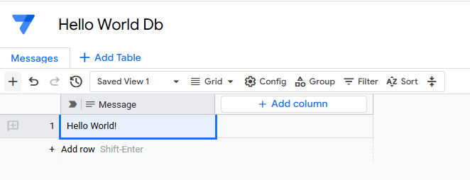