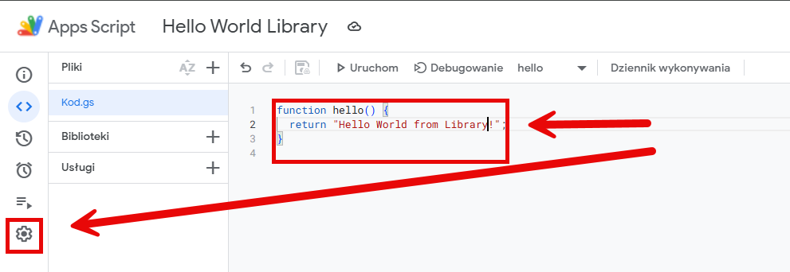
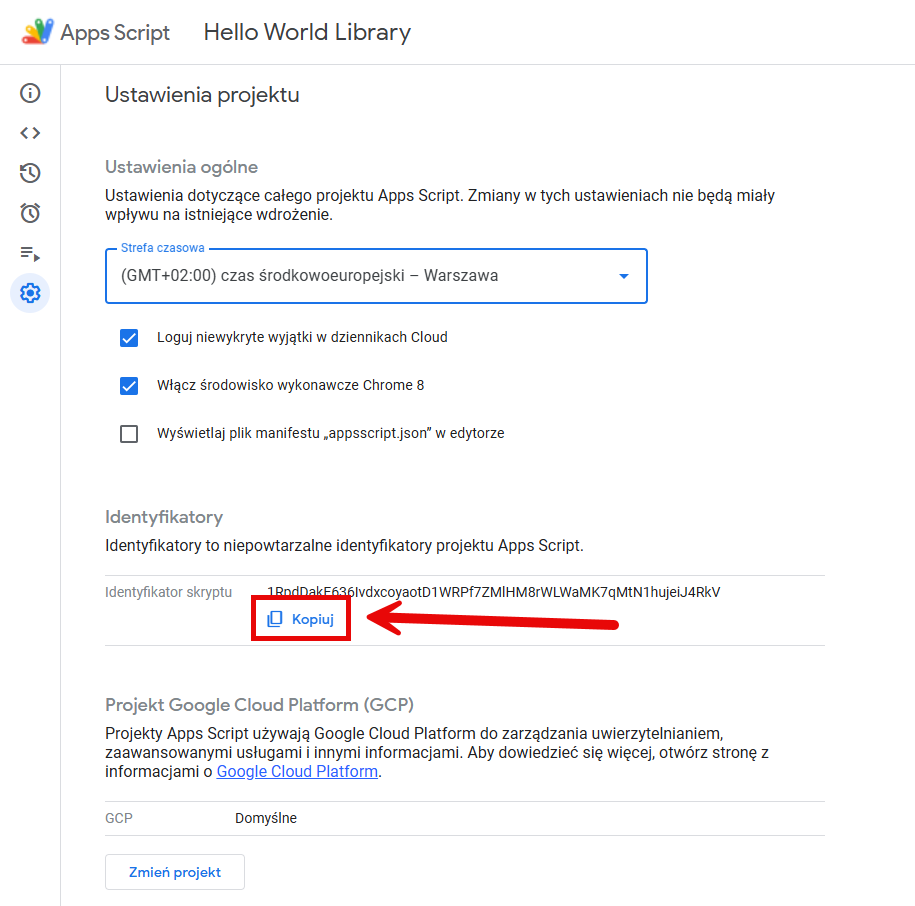
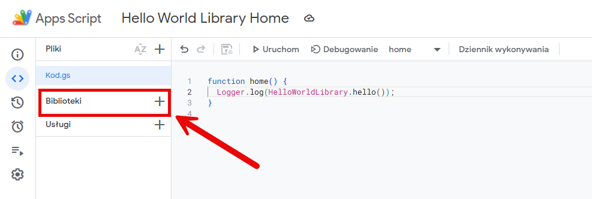
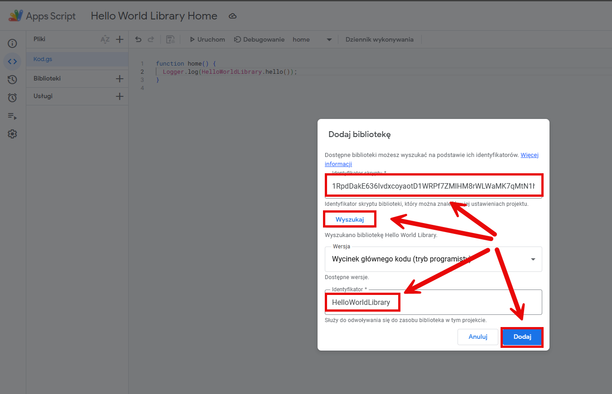
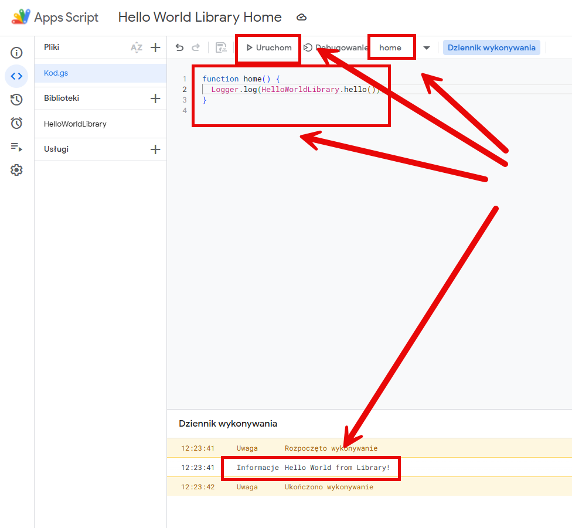

DESCRIPTION
-----------

**Google Apps Script** is a cloud-based JavaScript platform for automating tasks and extending Google Workspace apps like Sheets, Docs, and Gmail.

USAGE
-----

Link: https://script.google.com/home/my

EXAMPLE HELLO WORLD
-------------------

Link: https://script.google.com/home/projects/1s57BoZeym3GuHA6vd9ZzYtDKA7yiISJeidFb_g3LulAmoUb4zB_zRt7w/edit

EXAMPLE HELLO WORLD LIBRARY
---------------------------

Link: https://script.google.com/home/projects/1khfacNRGlEIZa8zyku8AhOyIBHANyzm3SpBuLyAlOEC2E8fDEyB14cJ7/edit

