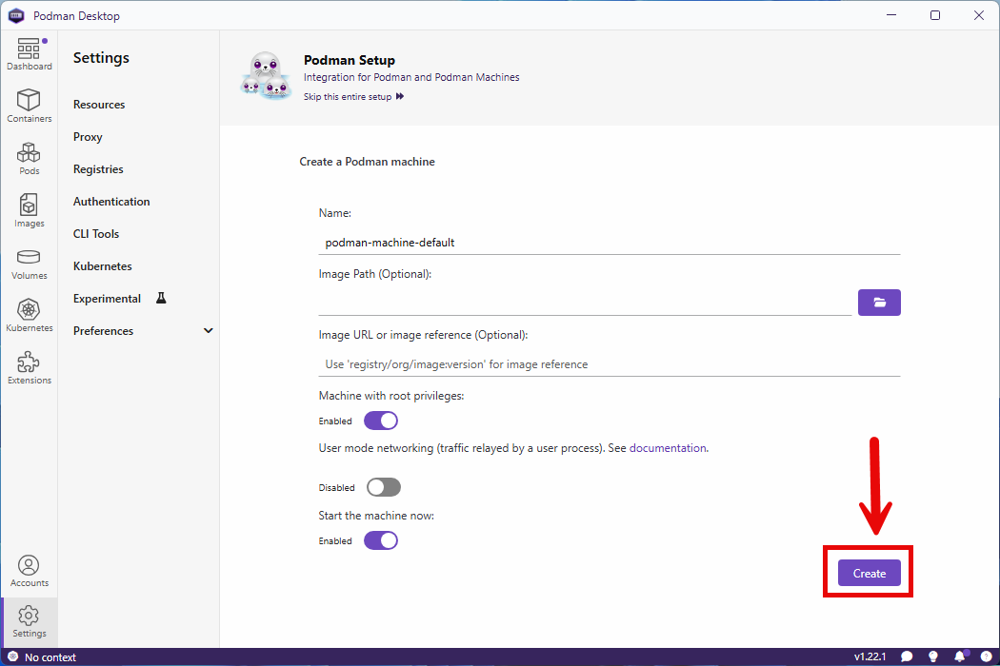
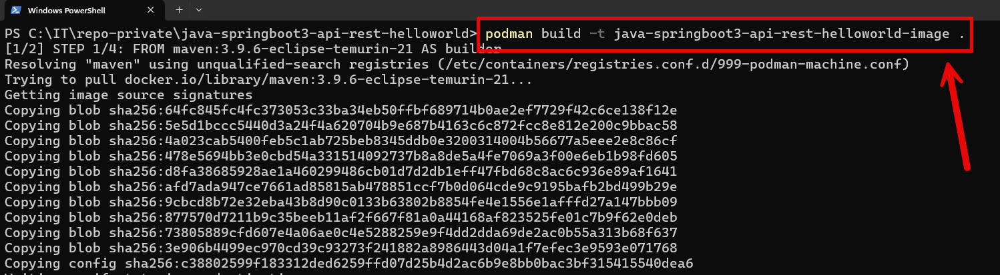
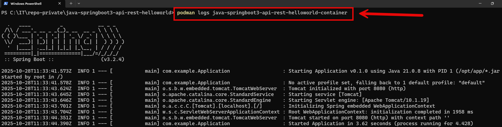
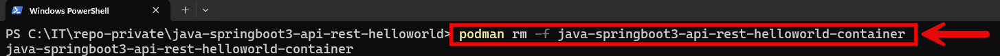
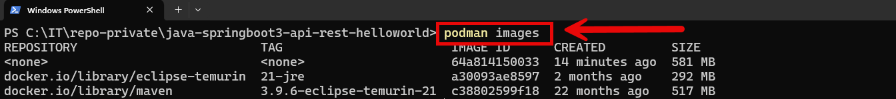
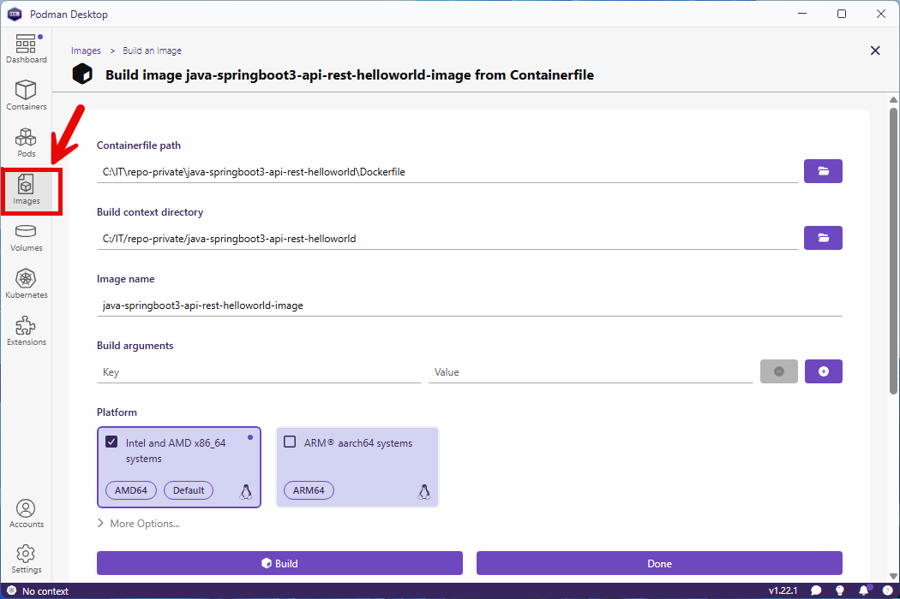
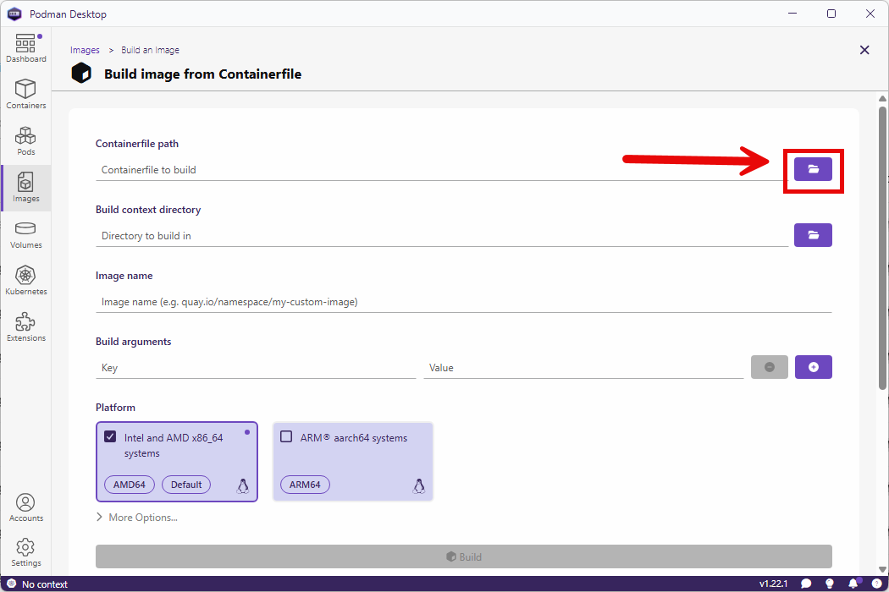
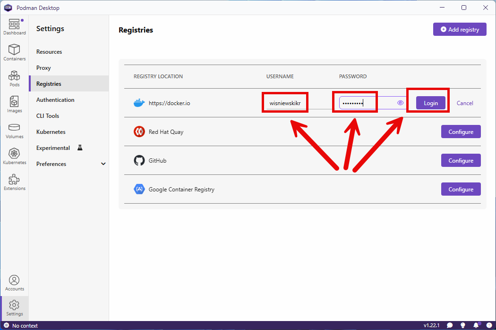
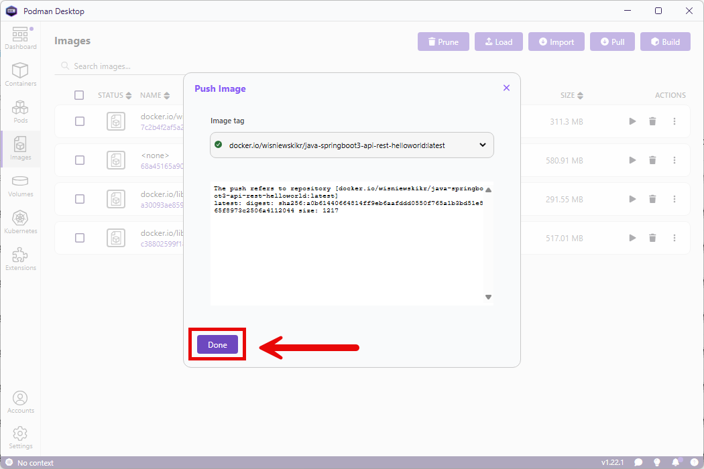

DESCRIPTION
-----------

**Podman** is an open-source container management tool that lets you build, run, and manage containers and 
pods — similar to Docker — but runs without a central daemon and can operate in rootless mode for improved security.

**Podman Desktop** is a graphical user interface (GUI) tool that helps users manage containers, images, pods, 
and Kubernetes resources using Podman, a container engine similar to Docker but daemonless and rootless. 
It provides an easy way to build, run, and manage containers locally without needing to use command-line tools.

INSTALLATION
------------

COMMAND LINE IMAGES AND CONTAINERS EXAMPLES
-------------------------------------------

Example commands:
1. Download example GIT project with `git clone git@github.com:wisniewskikr/java-springboot3-api-rest-helloworld.git`
2. Open any command line tool (e.g. Windows PowerShell) on just downloaded folder

PODMAN DESKTOP IMAGES AND CONTAINERS EXAMPLES
---------------------------------------------

Example commands:
1. Download example GIT project with `git clone git@github.com:wisniewskikr/java-springboot3-api-rest-helloworld.git`

COMMAND LINE PUSH AND PULL EXAMPLES
-----------------------------------

Example commands:
1. Download example GIT project with `git clone git@github.com:wisniewskikr/java-springboot3-api-rest-helloworld.git`
1. Open any command line tool (e.g. Windows PowerShell) on just downloaded folder

PODMAN DESKTOP PULL AND PUSH EXAMPLES
-------------------------------------

Example commands:
1. Download example GIT project with `git clone git@github.com:wisniewskikr/java-springboot3-api-rest-helloworld.git`

